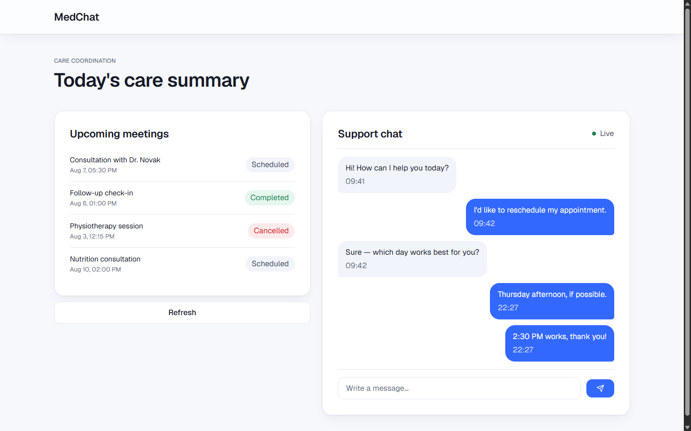

# MedChat

**Русский** · [English](README.en.md)

Интерфейс для координации ухода за пациентами: чат поддержки в реальном времени и
обзор ближайших встреч в одном окне. Построен на Next.js App Router.



## Обзор

MedChat - одностраничная панель (`/chat`) с двумя независимыми блоками:

- **Ближайшие встречи**: список, который рендерится на сервере и берёт данные из
  внутреннего API-маршрута. Клиент может обновить его по запросу.
- **Чат поддержки**: чат на WebSocket с оптимистичной отправкой, офлайн-очередью и
  автоматическим переподключением.

Блоки намеренно используют разные стратегии работы с данными (запрос/ответ и
постоянный сокет), потому что данные ведут себя по-разному: встречи читаются на
конкретный момент времени и дёшево перезапрашиваются, а чат - непрерывный поток,
который должен переживать разрывы соединения.

## Возможности

- Список встреч предзагружается на сервере и гидратируется на клиенте, есть ручное обновление
- Поле ввода чата с оптимистичным UI (pending → sent), гарантией порядка сообщений и
  очередью для сообщений, набранных в офлайне
- Автоматическое переподключение WebSocket с видимым статусом соединения (Live / Reconnecting / Offline)
- Небольшая дизайн-система на токенах (`components/ui`), без разовых стилей в компонентах фич

## Технологии

- **Next.js 16 (App Router) + React 19 + TypeScript**: маршрутизация, разделение на Server/Client-компоненты
- **Tailwind CSS v4**: тема на токенах в `app/globals.css`, используется через `components/ui`
- **TanStack Query v5**: серверная предзагрузка и клиентская гидратация списка встреч
- **Нативный WebSocket API**: без клиентской библиотеки; логика переподключения, очереди и
  подтверждений написана вручную в `hooks/useWebSocket.ts`, так как требования
  (офлайн-очередь, упорядоченные подтверждения) не ложатся на настройки по умолчанию
  универсальных сокет-библиотек

## Архитектура

### Server / Client-компоненты

`app/chat/page.tsx` - `async` **Server Component**. Он предзагружает запрос встреч на
сервере и передаёт дегидрированный кэш вниз через `HydrationBoundary`, так что список
встреч содержит данные уже при первой отрисовке и без мелькания индикатора загрузки
на клиенте. С `"use client"` помечены только части, которым нужна интерактивность:
`MeetingsPanel` (владеет `useQuery` и обновлением) и вся панель чата (`ChatPanel` и всё
под ним), поскольку WebSocket-соединение по своей природе существует только на клиенте.
Статические презентационные компоненты (`MeetingCard`, `MeetingList`, `ChatMessages`,
`ChatHeader`) остаются пригодными для серверного рендеринга. Они получают данные через
props и не используют клиентских API, так что отправлять их в клиентские бандлы незачем.

### Стратегия SSR для списка встреч

`getMeetings` (`lib/api/meetings.ts`) вызывается из двух разных окружений с разными
правилами разрешения URL, и модуль учитывает оба:

- На **сервере** у `fetch` нет неявного origin, относительно которого можно разрешить
  относительный путь, поэтому запросу нужен абсолютный URL. Он строится из
  `NEXT_PUBLIC_APP_URL`, если переменная задана, иначе из `http://localhost:<PORT>`
  для локальной разработки.
- В **браузере** запрос должен идти на тот origin, с которого загрузилась страница
  (ветка `typeof window !== "undefined"` использует относительный путь), поэтому тот же
  код продолжает работать после деплоя, а для локальной разработки не нужно задавать
  `NEXT_PUBLIC_APP_URL`.

`queryOptions` (`lib/query/meetings.ts`) - единственный источник правды для ключа
запроса и fetcher'а. Его используют и серверный вызов `prefetchQuery`, и клиентский
`useQuery`, так что способ получения встреч описан ровно в одном месте.

Route Handler в `app/api/meetings/route.ts` нужен потому, что клиентской кнопке
«Refresh» требуется что-то, что можно вызвать по HTTP. Серверная предзагрузка из
Server Component тоже идёт через него (а не читает мок-данные напрямую), чтобы у обоих
вызывающих был один путь запроса и чтобы это повторяло работу с настоящим бэкендом.

### Стратегия WebSocket

`hooks/useWebSocket.ts` владеет жизненным циклом сокета; `ChatPanel` владеет состоянием
чата, построенным поверх него. Осознанные решения:

- **Переподключение**: при любом закрытии новый сокет открывается через фиксированную
  задержку в 2 секунды. Backoff и ограничения числа попыток нет. Для этого объёма работы
  это приемлемо, ниже это указано как ограничение.
- **Безопасность при Strict Mode**: Strict Mode в React 19 в режиме разработки
  монтирует эффекты дважды, из-за чего может создаться сокет, который тут же
  закрывается. Обработчик `onclose` сбрасывает `socketRef` только если закрывающийся
  сокет всё ещё текущий, поэтому асинхронное событие закрытия устаревшего сокета не
  обнулит живое соединение, которое его заменило.
- **Идентичность сообщения, а не содержимое**: входящие сообщения хранятся как
  `{ data }`, то есть каждый раз как новый объект, а не как сырая строка. `ChatPanel`
  реагирует на входящее сообщение по ссылке в `useEffect`, а два подряд идущих эха с
  одинаковым текстом всё равно должны восприниматься как два отдельных поступления.
  Если хранить голую строку, React пропустит второе одинаковое значение и тихо его
  потеряет.
- **Офлайн-очередь и упорядоченные подтверждения**: `ChatPanel` держит два ref: outbox
  для сообщений, набранных без соединения, и FIFO из ID сообщений, ожидающих эха. Это
  предполагает, что транспорт возвращает отправленное в том порядке, в котором получил.
  Для эхо-сервера, на который рассчитано приложение (`NEXT_PUBLIC_CHAT_WS_URL`), это
  выполняется.

## Структура проекта

```
app/
  chat/            /chat route: Server Component page, mock seed messages
  api/meetings/     Route Handler backing the meetings list
components/
  chat/            Chat panel and its subcomponents
  meetings/        Meetings panel and its subcomponents
  ui/              Design system primitives (Button, Card, Badge, Input, ...)
hooks/
  useWebSocket.ts  Socket lifecycle: connect, reconnect, send, status
lib/
  api/             Fetch functions (server- and client-callable)
  query/           TanStack Query options and query keys
providers/         QueryClientProvider setup
types/             Shared domain types
```

## Проектные решения

- **Паттерн Query Options** (`lib/query/meetings.ts`): ключ запроса и fetcher
  определяются один раз через `queryOptions(...)` и переиспользуются и серверной
  предзагрузкой, и клиентским хуком, так что риска их расхождения нет.
- **Новый `QueryClient` на каждый серверный запрос и на каждое клиентское
  монтирование**: `createQueryClient()` вызывается прямо в Server Component (новый
  экземпляр на запрос, поэтому кэш не делится между запросами) и внутри
  `useState(() => createQueryClient())` в клиентском провайдере (создаётся один раз
  на монтирование и не пересоздаётся при повторном рендере).
- **Без библиотеки анимаций**: два эффекта движения в приложении (пульсация статуса,
  точки загрузки) сделаны обычными CSS `@keyframes` в `globals.css` и подключены через
  токены темы Tailwind `--animate-*`. Два эффекта не стоят отдельной зависимости.

## Известные ограничения

- Встречи отдаются из статического массива в памяти (`app/api/meetings/route.ts`);
  сохранения данных и пути записи нет.
- Переподключение WebSocket использует фиксированную задержку в 2 секунды, без backoff
  и без предельного числа попыток. Для демо это нормально, но с нестабильным
  production-эндпоинтом так лучше не делать.
- У списка сообщений чата нет контейнера с прокруткой и максимальной высоты; на
  демо-объёме это нормально, но для длинной переписки он понадобится.
- Время сообщений чата (`en-GB`, 24-часовой формат) и время встреч (`en-US`,
  12-часовой формат) используют разные форматы локали. Это косметика, и она не
  исправлена, так как не влияет на корректность.

## Локальный запуск

```bash
npm install
npm run dev
```

Откройте [http://localhost:3000](http://localhost:3000). Страница перенаправит на `/chat`.

Панель чата подключается к `NEXT_PUBLIC_CHAT_WS_URL` (по умолчанию `ws://localhost:8081`);
если по этому адресу нет работающего сервера, статус будет «переподключение».

## Скрипты

- `npm run dev`: запустить сервер разработки
- `npm run build` / `npm run start`: production-сборка и её запуск
- `npm run lint`: ESLint
- `npm run format` / `npm run format:check`: Prettier
- `npm run knip`: отчёт о неиспользуемых файлах и экспортах
